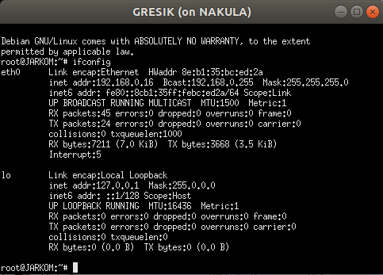

# Modul 3

 - DHCP 
	 * <a href="#soal-1">soal 1 </a>
	 * <a href="#soal-2">soal 2 </a>
	 * <a href="#soal-3-6">soal 3-6 </a>
 - Proxy 
	 * <a href="#soal-7">soal 7 </a>
	 * <a href="#soal-8-9">soal 8-9 </a>
	 * <a href="#soal-10">soal 10 </a>
     * <a href="#soal-11">soal 11 </a>
 - Testing
## DHCP
<justify>

1. Membuat topologi jaringan​ demi kelancaran TA-nya dengan kriteria sebagai berikut:

</justify>

<justify>

2. SURABAYA ​ ditunjuk sebagai perantara (​ DHCP Relay​ ) antara DHCP Server dan client:

Kofigurasi isc-dhcp-relay pada Surabaya :

    - <code>SERVERS</code> : Menuju IP Server DHCP Server, yaitu IP Mojokerto  
    - <code>INTERFACES</code> : Menuju interface client dan server  

Kofigurasi isc-dhcp-relay pada Tuban (DHCP Server):

    - <code>INTERFACES</code> : Interface pada tuban yang mengarah ke DHCP relay  

Tambahkan konfigurasi pada DHCP Server agar mengenali topologi, dalam kasus ini   agar DHCP Server menemukan DHCP Relay dengan mengenalkan subnet yang berada diantaranya

</justify>

<justify>

3. Client pada subnet 1 mendapatkan range IP dari 192.168.0.10 sampai 192.168.0.100 dan 192.168.0.110 sampai 192.168.0.200 

4. ​Client pada subnet 3 mendapatkan range IP dari 192.168.1.50 sampai 192.168.1.70 

5. ​Client mendapatkan DNS Malang dan DNS 202.46.129.2 dari DHCP 

6. Client di subnet 1 mendapatkan peminjaman alamat IP selama 5 menit, sedangkan client pada subnet 3 mendapatkan peminjaman IP selama 10 menit. 

Client pada Subnet 1 :

Client pada Subnet 2 :

</justify>

## PROXY
<justify>

7. Membuat User autentikasi pada proxy:

    htpasswd -c /etc/squid/passwd userta_d03
    pass : inipassw0rdta_d03

	mv /etc/squid/squid.conf /etc/squid/squid.conf.bak
	nano /etc/squid/squid.conf

    auth_param basic program /usr/lib/squid/ncsa_auth /etc/squid/passwd
	auth_param basic children 5
	auth_param basic realm Proxy
	auth_param basic credentialsttl 2 hours
	auth_param basic casesensitive on
	acl USERS proxy_auth REQUIRED

</justify>

<justify>

8. Membatasi penggunaan internet setiap hari ​Selasa-Rabu pukul 13.00-18.00​ untuk mengerjakan TA

9. Selasa-Kamis pukul 21.00 - 09.00 untuk bimbingan TA

Konfigurasi time pada squid

    include /etc/squid/acl.conf

    http_access allow USERS PENGERJAAN_TA
	http_access allow USERS BIMBINGAN_TA
	http_access allow USERS BIMBINGAN_TA_2
</justify>

<justify>

10. Setiap mengakses google.com, maka akan di redirect menuju monta.if.its.ac.id​ agar Anri selalu ingat untuk mengerjakan TA

	acl BLACKLISTS dstdomain google.com
	http_access deny BLACKLISTS
	deny_info http://monta.if.its.ac.id BLACKLISTS
</justify>

<justify>

10. Mengubah ​ error page default squid

    cp -r ERR_ACCESS_DENIED /usr/share/squid/errors/English/ERR_ACCESS_DENIED
    
</justify>

<justify>

12. Domain proxy janganlupa-ta.d03.pw ​dan memasukkan port ​8080​

Buat DNS di Malang (DNS Server)

Konfigurasi DNS Forwarder agar bisa tetap terhubung ke internet

Tambahkan domain tersebut pada <code>visible_hostname</code> squid

    http_port 8080
	visible_hostname janganlupa-ta.d03.pw
</justify>

<justify>

Konfigurasi proxy (secara keseluruhan) :

</justify>

## Testing
<justify>

Ketika time di Mojokerto diubah menjadi Selasa pukul 15:00, saat mengakses google maka akan diarahkan ke monta seperti gambar dibawah ini :

</justify>